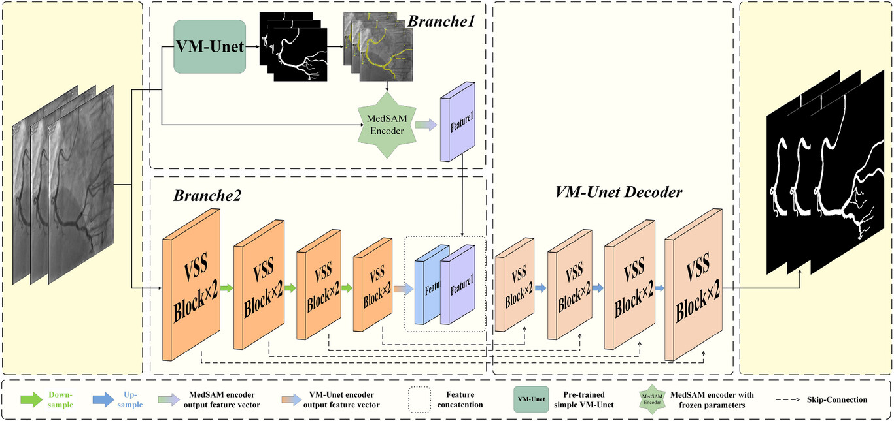

# SAM-VMNet

[](https://huggingface.co/ly17/SAM-VMNet)

This is the official code repository for "Deep learning model for coronary artery segmentation and quantitative stenosis detection in angiographic images", which is accpeted by **Medical Physics** as a research article!

> **🌐 Official Website**: This repository now includes a modern website showcasing the project. See the [Website Section](#website) below for details.



*Figure 1: The overall architecture of SAM-VMNet combining VMUnet (Vision-based Medical Network) with SAM (Segment Anything Model)*

## Prepare

To set up the project, follow these steps:

**Clone the repository**:

```bash
git clone https://github.com/qimingfan10/SAM-VMNet.git
cd SAM-VMNet
```

## 0. Environments

```bash
pip install -r requirements.txt
```

The .whl files of mamba_ssm could be found [here](https://github.com/state-spaces/mamba). The .whl files of causal_conv1d could be found [here](https://github.com/Dao-AILab/causal-conv1d).

## 1. Download the pre-trained weights

Download the following files from Google Drive and place them in the `./pre_trained_weights` directory:

- [vmamba_small_e238_ema.pth](https://drive.google.com/file/d/1XL7JuacjoZCr8w2b0c8CaQn8b0hREblk/view?usp=drive_link)

- [best-epoch142-loss0.3230.pth](https://drive.google.com/file/d/1jsZKakA4FrYaMXNp6qkVtxXwwcJQKrW4/view?usp=drive_link)

- [best-epoch142-loss0.3488.pth](https://drive.google.com/file/d/1OKIzUM_L6FeEqyuIsAMn4x-FHptizTkG/view?usp=drive_link)

- [MedSAM_model.pth](https://drive.google.com/file/d/1O5IVkcVxd2RtOcZEKuTR3WkOBiosHBfz/view?usp=drive_link)

## 2. Prepare the datasets

Download the ARCADE from [zenodo](https://zenodo.org/records/12345678).

After downloading the datasets, you are supposed to put them into `./data/vessel/` and the file format reference is as follows.

```
- './data/vessel/'
  - train
    - images
      - .png
    - masks
      - .png
  - val
    - images
      - .png
    - masks
      - .png
  - test
    - images
      - .png
    - masks
      - .png
```

## 3. Usage

```bash
bash train.sh
```

First, train the Pure VM-UNet of Branch 1. The trained weights will be saved in `./result_branch1/`.

```bash
bash test.sh
```

Then, use the trained weights to predict the test set images and obtain pred_masks.

```bash
bash train.sh
```

Finally, train the SAM-VMNet of Branch 2. The trained weights will be saved in `./result_branch1/`.

## 4. Vessel Stenosis Detection (MATLAB)

This repository also includes MATLAB code for quantitative stenosis detection in segmented vessel images. The stenosis detection module complements the deep learning segmentation pipeline by providing detailed analysis of vessel narrowing.

**📚 Quick Links:**
- 🚀 [Quick Start Guide](QUICK_START_STENOSIS.md) - Get started in 5 minutes!
- 📖 [Detailed Documentation](stenosis_detection/README_stenosis.md)
- 💡 [Usage Examples](stenosis_detection/USAGE_EXAMPLES.md)
- 📝 [Changelog](CHANGELOG_STENOSIS.md)

### 4.1 Overview

The stenosis detection module (`stenosis_detection/maskjiance1016.m`) performs comprehensive analysis including:
- Centerline extraction using skeletonization
- Radius calculation for each centerline point using Method of Moments
- Segmentation point detection (bifurcation points)
- Path finding between segmentation points
- Stenosis detection with degree calculation
- Result visualization with color-coded stenosis points

### 4.2 Files

The stenosis detection code is located in the `stenosis_detection/` directory:

**Main Function:**
- `maskjiance1016.m` - Main stenosis detection script

**Supporting Functions:**
- `MoMforSeg1.m` - Radius calculation using Method of Moments
- `check_neighbors.m` - Neighbor checking for skeleton points
- `findpath2.m` - Shortest path finding on skeleton graph
- `getRadius.m` - Radius retrieval function
- `duilie.m` - Queue processing for stenosis detection
- `getNeighbors.m` - 8-connected neighbor retrieval

**Documentation:**
- `README_stenosis.md` - Complete documentation for stenosis detection module

### 4.3 Quick Start

**One-Click Startup (Recommended):**

Using bash script (Linux/Mac):
```bash
./run_stenosis_detection.sh [original_image_path] [mask_image_path]
```

Using Python script (Cross-platform):
```bash
python run_stenosis_detection.py [original_image_path] [mask_image_path]
```

**Example:**
```bash
# With image paths
./run_stenosis_detection.sh data/test.jpg data/test_mask.png

# Or run with default images (need to edit maskjiance1016.m first)
./run_stenosis_detection.sh
```

### 4.4 Manual Usage

1. **Prepare Input Images:**
   - Original image: Original vessel angiographic image
   - Segmented mask: Binary mask image after segmentation (from SAM-VMNet or other segmentation methods)

2. **Modify Image Paths:**
   Edit `stenosis_detection/maskjiance1016.m`:
   ```matlab
   Im = imread("your_original_image.jpg");
   im = imread("your_segmented_mask.png");
   ```

3. **Run Detection in MATLAB:**
   ```matlab
   cd stenosis_detection
   maskjiance1016
   ```

4. **View Results:**
   - Figure 1: Centerline extraction result
   - Figure 2: Segmentation points detection result
   - Figure 3: Stenosis detection result with color-coded stenosis points

### 4.5 Output

The detection results include:
- **Stenosis Points**: Coordinates of detected stenosis locations
- **Stenosis Degrees**: Quantitative stenosis severity (0-1 scale)
- **Visualization**: Color-coded markers indicating stenosis severity:
  - Red: Severe stenosis (>75%)
  - Green: Moderate stenosis (50-75%)
  - Blue: Mild stenosis (25-50%)

### 4.6 System Requirements

- MATLAB R2016b or higher
- Image Processing Toolbox

For detailed usage instructions and parameter tuning, please refer to `stenosis_detection/README_stenosis.md`.

## Website

This repository includes a modern, responsive website built with React and TailwindCSS that showcases the SAM-VMNet project.

### Features

- 📱 Fully responsive design
- 🎨 Modern UI with smooth animations
- 📖 Interactive documentation
- 🔬 Demo and visualization showcase
- 📥 Easy access to downloads and resources

### Quick Start

**Development:**
```bash
npm install
npm run dev
```

**Production Build:**
```bash
npm run build
```

The built website will be in the `dist/` directory and is ready to deploy to any static hosting service.

### Pages

- **Home**: Project overview and key features
- **About**: Research background and methodology
- **Features**: Technical details and architecture
- **Demo**: Interactive demonstration and workflow
- **Documentation**: Complete setup and usage guide
- **Downloads**: Pre-trained models and datasets

Visit the deployed website or run locally to explore all features!

## License

This project is licensed under the Apache-2.0 License. See the LICENSE file for more details.

## Citation

If you use this project in your research, please cite the following paper:

```bibtex
@article{https://doi.org/10.1002/mp.17970,
author = {Huang, Baixiang and Luo, Yu and Wei, Guangyu and He, Songyan and Shao, Yushuang and Zeng, Xueying and Zhang, Qing},
title = {Deep learning model for coronary artery segmentation and quantitative stenosis detection in angiographic images},
journal = {Medical Physics},
volume = {52},
number = {7},
pages = {e17970},
doi = {https://doi.org/10.1002/mp.17970},
year = {2025}
}
```

---

For any questions or issues, please open an issue on this repository.

